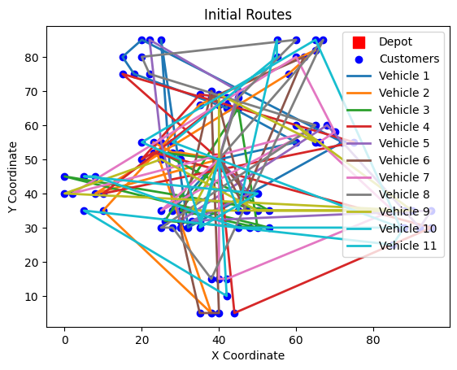

# VRPTW_GA
## Prerequisites:
- Python 3.13
- Python standard library
  - Math
  - Time
  - Random
  - Threading
  - Queue
  - OS
- Matplotlib package
- Pandas package
- Numpy package
## Data
- Data consists of Solomon VRPTW datasets collected from: https://www.sintef.no/projectweb/top/vrptw/solomon-benchmark/
## How to run:
1. Install requirements
   `pip install requirements.txt`
3. Ensure you have Solomon datasets in data folder
4. Run main.py
   `run main.py`
## Parameters
1. Instances:
   - C108.txt
   - C203.txt
   - C249.txt
   - C266.txt
   - R146.txt
   - R202.txt
   - RC207.txt
3. Genetic Algorithm Parameters
   - Generations: 100
   - Population size: 50
   - Vehicles: 11
   - Mutation rate: 20%
   - Crossover rate: 80%
   - Top N = 40%
## Example Output
This plot is saved to ./figures  

GA results for C108:  
Duration: 6.959(s)  
Route #, Route Length, Route Time  
1, 11, 1257.08  
2, 10, 1260.41  
3, 10, 1280.59  
4, 10, 1120.05  
5, 10, 1411.67  
6, 10, 1333.19  
7, 10, 1293.82  
8, 10, 1143.04  
9, 10, 1237.28  
10, 10, 1165.77  
11, 10, 1156.90  
Totals: 111, 13659.80
